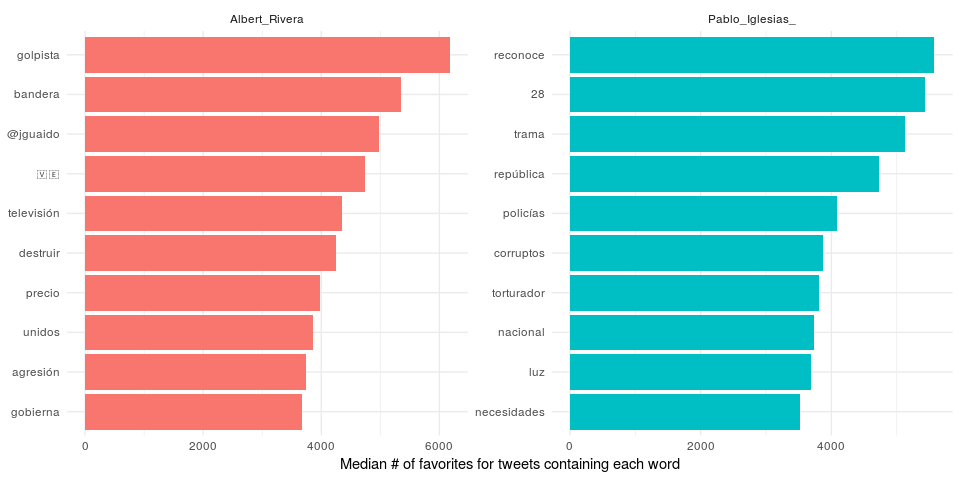

# Twitter Analysis with R
## Analysis of Twitter accounts of the main political leaders in Spain before the elections of April 28, 2019
### Pol Castellano-Escuder
### Apr, 2019

---

**_This document is an EXPLORATORY document that consists of an example of text extraction and analysis on Twitter with R and in no case aims to lead to CONCLUSIONS._**

# Comparison between two Twitter accounts

## Getting the data

The data is extracted from Twitter using the R package **twitteR**. We can extract the **last 3200 tweets** for each Twitter account.

The data extracted have the following structure:

<table class="table table-striped table-bordered" style="margin-left: auto; margin-right: auto;">
 <thead>
  <tr>
   <th style="text-align:left;"> text </th>
   <th style="text-align:left;"> favorited </th>
   <th style="text-align:right;"> favoriteCount </th>
   <th style="text-align:left;"> replyToSN </th>
   <th style="text-align:left;"> created </th>
   <th style="text-align:left;"> truncated </th>
   <th style="text-align:left;"> replyToSID </th>
   <th style="text-align:left;"> id </th>
   <th style="text-align:left;"> replyToUID </th>
   <th style="text-align:left;"> statusSource </th>
   <th style="text-align:left;"> screenName </th>
   <th style="text-align:right;"> retweetCount </th>
   <th style="text-align:left;"> isRetweet </th>
   <th style="text-align:left;"> retweeted </th>
  </tr>
 </thead>
<tbody>
  <tr>
   <td style="text-align:left;"> Esta tarde estaré en Gijón, y mañana tendré el placer de regresar a l'Hospitalet para participar en un acto junto a… https://t.co/raSPPq0ZdU </td>
   <td style="text-align:left;"> FALSE </td>
   <td style="text-align:right;"> 73 </td>
   <td style="text-align:left;"> NA </td>
   <td style="text-align:left;"> 2019-04-05 13:44:10 </td>
   <td style="text-align:left;"> TRUE </td>
   <td style="text-align:left;"> NA </td>
   <td style="text-align:left;"> 1114161809215324166 </td>
   <td style="text-align:left;"> NA </td>
   <td style="text-align:left;"> &lt;a href="http://twitter.com" rel="nofollow"&gt;Twitter Web Client&lt;/a&gt; </td>
   <td style="text-align:left;"> Pablo_Iglesias_ </td>
   <td style="text-align:right;"> 34 </td>
   <td style="text-align:left;"> FALSE </td>
   <td style="text-align:left;"> FALSE </td>
  </tr>
  <tr>
   <td style="text-align:left;"> RT @MayoralRafa: Interesante entrevista a David Jiménez ex director de El Mundo. Habla de los tres poderes que existen en nuestro país en e… </td>
   <td style="text-align:left;"> FALSE </td>
   <td style="text-align:right;"> 0 </td>
   <td style="text-align:left;"> NA </td>
   <td style="text-align:left;"> 2019-04-05 13:31:09 </td>
   <td style="text-align:left;"> FALSE </td>
   <td style="text-align:left;"> NA </td>
   <td style="text-align:left;"> 1114158535187804160 </td>
   <td style="text-align:left;"> NA </td>
   <td style="text-align:left;"> &lt;a href="http://twitter.com/download/iphone" rel="nofollow"&gt;Twitter for iPhone&lt;/a&gt; </td>
   <td style="text-align:left;"> Pablo_Iglesias_ </td>
   <td style="text-align:right;"> 195 </td>
   <td style="text-align:left;"> TRUE </td>
   <td style="text-align:left;"> FALSE </td>
  </tr>
  <tr>
   <td style="text-align:left;"> RT @ikaitor: Ojo a esta entrevista a David Jiménez, exdirector de El Mundo y autor del libro El Director

"En 2015 las élites veían con ter… </td>
   <td style="text-align:left;"> FALSE </td>
   <td style="text-align:right;"> 0 </td>
   <td style="text-align:left;"> NA </td>
   <td style="text-align:left;"> 2019-04-05 13:23:03 </td>
   <td style="text-align:left;"> FALSE </td>
   <td style="text-align:left;"> NA </td>
   <td style="text-align:left;"> 1114156494877089792 </td>
   <td style="text-align:left;"> NA </td>
   <td style="text-align:left;"> &lt;a href="http://twitter.com/download/iphone" rel="nofollow"&gt;Twitter for iPhone&lt;/a&gt; </td>
   <td style="text-align:left;"> Pablo_Iglesias_ </td>
   <td style="text-align:right;"> 106 </td>
   <td style="text-align:left;"> TRUE </td>
   <td style="text-align:left;"> FALSE </td>
  </tr>
  <tr>
   <td style="text-align:left;"> RT @VickyRosell: (Una periodista) vino a verme indignada porque desde la policía política del ministro Fernández Díaz se estaba ofreciendo… </td>
   <td style="text-align:left;"> FALSE </td>
   <td style="text-align:right;"> 0 </td>
   <td style="text-align:left;"> NA </td>
   <td style="text-align:left;"> 2019-04-05 13:22:25 </td>
   <td style="text-align:left;"> FALSE </td>
   <td style="text-align:left;"> NA </td>
   <td style="text-align:left;"> 1114156336978198530 </td>
   <td style="text-align:left;"> NA </td>
   <td style="text-align:left;"> &lt;a href="http://twitter.com/download/iphone" rel="nofollow"&gt;Twitter for iPhone&lt;/a&gt; </td>
   <td style="text-align:left;"> Pablo_Iglesias_ </td>
   <td style="text-align:right;"> 331 </td>
   <td style="text-align:left;"> TRUE </td>
   <td style="text-align:left;"> FALSE </td>
  </tr>
</tbody>
</table>

## Word frequencies

We can obtain the frequencies for each word in all extracted tweets. 

This plot shows the frequency of words used by Albert Rivera and Pablo Iglesias. The words over the red line are used similary (in terms of frequency) by both users.

## Comparing word usage

Here we can see which words are most likely to be from Albert Rivera's account or from Pablo Iglesias's account.  

In the following plot we can see the odds ratios of the top 15 most distinctive words for each account.

## Changes in word use

The frequencies of the words used by users may change over time. Here we will explore the most important word frequency changes along time for each user. 

We will fit a generalized linear model using "binomial" family for modeling and we will pick associations with an adjusted p.value below 0.05. The following plot shows the results.

  
## Retweets

This plot shows which words are more likely to be retweeted for Albert Rivera and Pablo Iglesias.

## Favorites

This plot is very similar to the previous plot and it shows which words are more likely to be favorited for Albert Rivera and Pablo Iglesias.

# Comparison between more than two Twitter accounts

This block is an example of the analysis of more than two Twitter accounts. The only difference with previous plots is the number of accounts (except in PCA). Therefore, the explanation of the plots is the same ;-)

## Getting the data

## Principal Component Analysis between all accounts

The Principal Component Analysis is a multivariate method for the reduction of dimention. 

Using the frequency matrix for all words in all accounts we can make the following PCA. The closer the points are in the space the more similar they are and vice versa.

As a small conclusion... 

In the plot we can see 3 groups, which COULD correspond to the left, right and far right political parties. However, we will not say which is which ;-)

## Changes in word use

## Retweets

## Favorites

# References

1) Mullen, Lincoln. 2016. tokenizers: A Consistent Interface to Tokenize Natural Language Text. https://CRAN.R-project.org/package=tokenizers.

2) Henry, Lionel, and Hadley Wickham. 2018. Purrr: Functional Programming Tools. https://CRAN.R-project.org/package=purrr.

3) Julia Silge and David Robinson. 2019. Text Mining with R. https://www.tidytextmining.com/twitter.html

